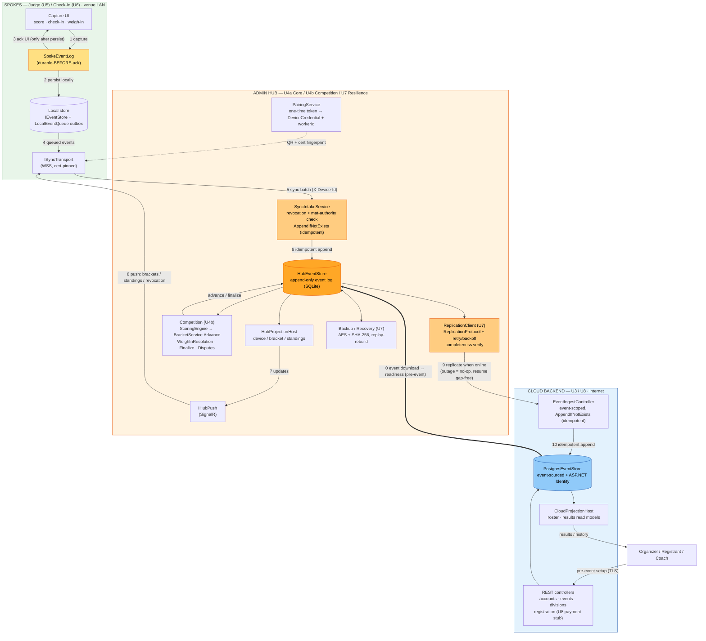

# EventManager — Hub-and-Spoke End-to-End Data Flow

As-built data flow across the spokes (U5 Judge / U6 Check-In), the admin hub (U4a Core / U4b
Competition / U7 Resilience), and the cloud backend (U3 / U8).

Two views are provided:
- **[`data-flow.svg`](data-flow.svg)** — a hand-drawn, precisely-laid-out SVG (open it directly in a
  browser or VS Code; it is theme-aware). This is the presentation view.
- The **Mermaid** source below — the editable, version-friendly source of truth (GitHub renders it
  natively; in VS Code use the "Markdown Preview Mermaid Support" extension).

## Presentation view (SVG)

## Editable source (Mermaid)

## The numbered flow
- **0** — Before event day, the cloud event is **downloaded to the hub** (readiness gate); the hub then runs with zero internet.
- **1–4** — A spoke captures an action, writes it **durably to its local log before acking the UI** (NFR-1.1, zero loss), and queues it.
- **5–6** — The queued batch syncs to the hub; `SyncIntakeService` checks device revocation + mat authority and does an **idempotent append** (replays never duplicate).
- **7–8** — The hub folds projections / advances brackets and **pushes updates back** to spokes over SignalR.
- **9–10** — When the internet returns, the hub **replicates its log to the cloud** idempotently (an outage is a no-op that resumes gap-free); the cloud is a **mirror**, never a conflicting source of truth.

**Invariant across every hop:** `AppendIfNotExists` (idempotent) + durable-before-ack = the zero-loss, no-duplicate backbone. Backup/Recovery guards the hub log independently.
