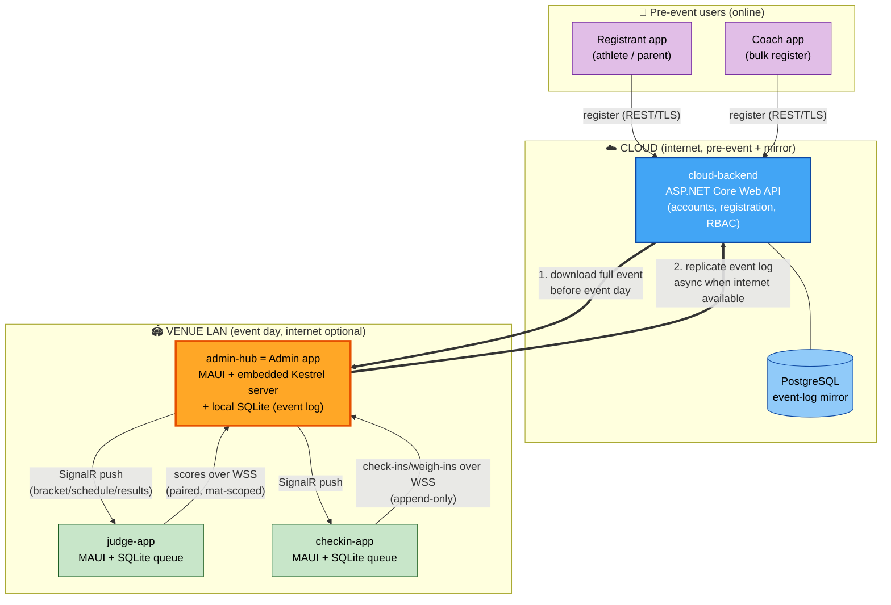
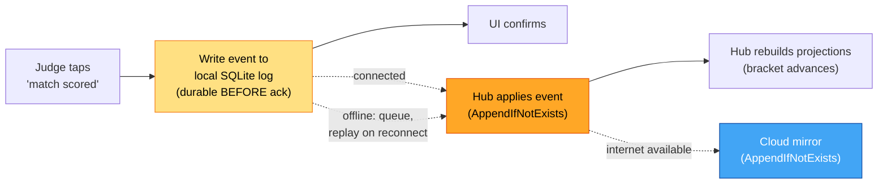
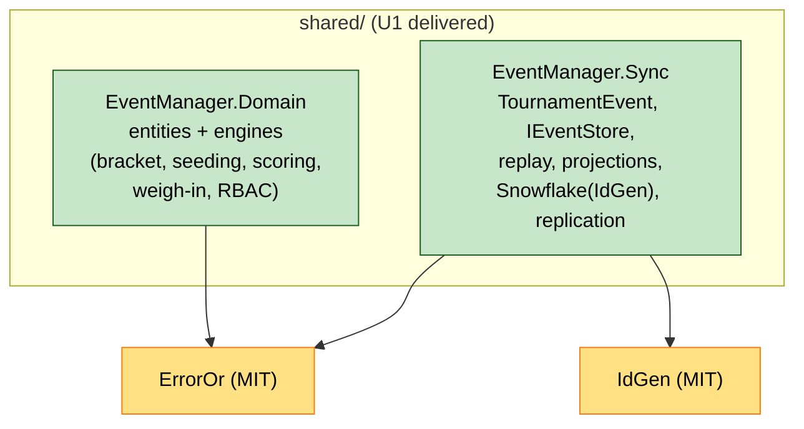
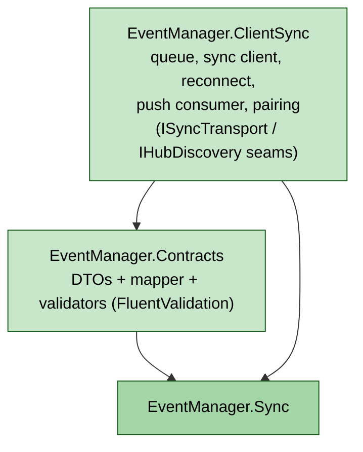
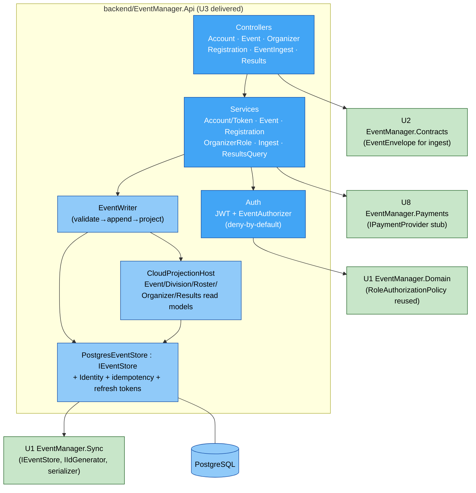
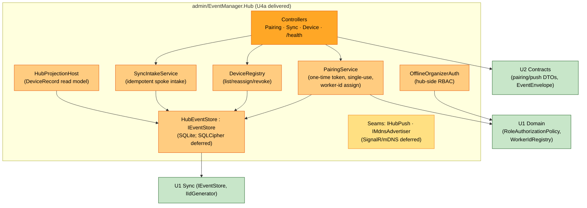
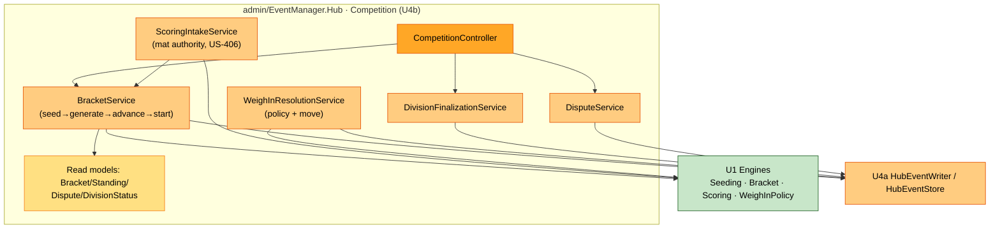
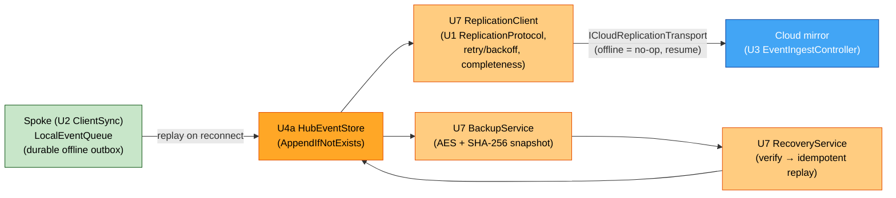
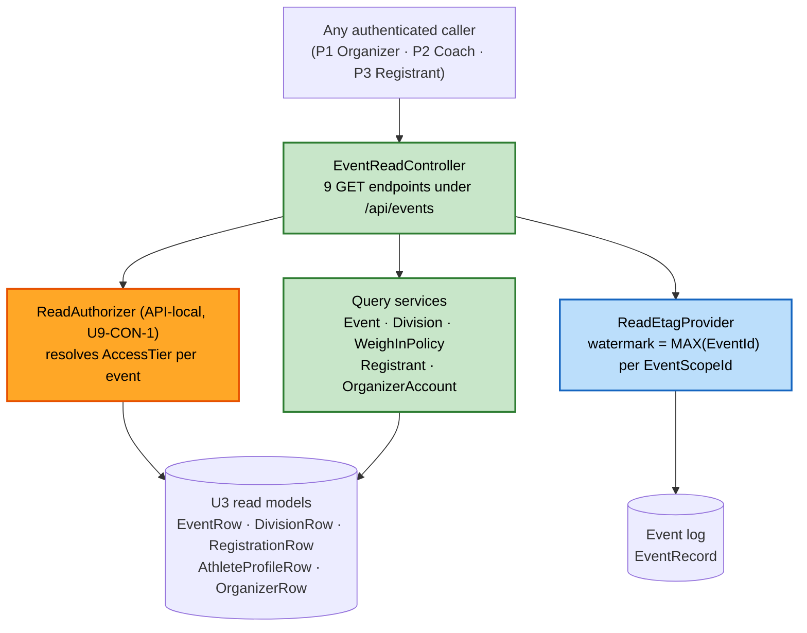

# EventManager — Architecture Overview (orientation draft)

**Status**: Part of the Application Design artifact set (topology + event-flow views). Complements `component-dependency.md` (package graph).
**Source**: tech-env.md "Architecture and Patterns"; requirements.md FR-4 / NFR-6.2.

This is the **hub-and-spoke, offline-first, event-sourced** architecture in two views: (1) topology — who talks to whom; (2) event flow — how data moves without loss.

---

## View 1 — Topology (two worlds: Cloud pre-event, Venue LAN on event day)



**Key point**: the **Admin app IS the hub** — it embeds a web server so Judge/Check-In connect to *it* on the venue LAN, with or without internet. The cloud is only touched twice: download the event beforehand (arrow 1), and mirror the log afterward/whenever online (arrow 2).

### Text alternative
```
CLOUD (online):  Registrant + Coach  --REST/TLS-->  cloud-backend --- PostgreSQL (mirror)

                         | (1) download event before event day
                         v
VENUE LAN (event day, internet optional):
    admin-hub (Admin app = MAUI + embedded Kestrel + SQLite event log)
        <--- scores (WSS, mat-scoped) ---  judge-app  (MAUI + SQLite queue)
        <--- check-ins (WSS, append)  ---  checkin-app (MAUI + SQLite queue)
        ---- SignalR push (brackets/schedule/results) --->  both spokes
                         |
                         | (2) replicate event log async when internet available
                         v
                   cloud-backend  (mirror, never a conflicting source of truth)
```

---

## View 2 — Event flow (why nothing is lost)

Every action becomes an immutable, numbered event. State is a *replay* of the log. Replay is idempotent, so the same event applied twice changes nothing — that is what makes offline queue → reconnect → replay safe.



**The backbone**: `event → local durable write → (queue if offline) → hub applies idempotently → projections update → cloud mirrors idempotently`. The `AppendIfNotExists` idempotence is shown literally in the tech-env.md code sample (lines 86–101).

### Text alternative
```
1. Judge taps "match scored"
2. Event written to device's local SQLite log  (durable BEFORE the UI confirms) -> zero loss
3. If hub reachable: send now.  If offline: queue locally, replay in order on reconnect.
4. Hub applies event with AppendIfNotExists (duplicate replays are no-ops) -> no duplicates
5. Hub rebuilds projections (bracket advances, standings update)
6. When internet is available, hub mirrors the same log to the cloud, also idempotently
```

---

## How this maps to the 5 modules (the D-07 repo layout)

| Module (folder) | Is | Runtime |
|---|---|---|
| `shared/` (**shared-sync-core**, maybe + domain) | Reusable library: event model, log store, idempotent replay, projections (and possibly bracket/scoring engines — that's **Q1/Q2** in the plan) | Consumed by all apps via local NuGet |
| `backend/` (**cloud-backend**) | ASP.NET Core Web API + PostgreSQL, in Docker | Cloud |
| `admin/` (**admin-hub**) | Admin MAUI app + embedded Kestrel = the LAN hub | Organizer's laptop/iPad |
| `judge/` (**judge-app**) | Judge MAUI spoke app | Judges' phones/tablets |
| `checkin/` (**checkin-app**) | Check-In MAUI spoke app | Front-table device |

The design questions (Q1–Q7) are all asking: **which box does each piece of logic live in, and where does it run** — especially how much goes into the shared `shared/` library vs. each app.

---

## As-built: U1 Shared Core (updated 2026-07-24, end-of-unit)

U1 delivered the `shared/` foundation. Internal structure as-built:



**As-built refinements (vs. the high-level graph in `component-dependency.md`):**
- **`EventManager.Sync` is independent of `EventManager.Domain`.** Event payloads are opaque bytes at the Sync layer, so the event-sourcing plumbing is generic and reusable; concrete domain projections live in consuming units. (The earlier `Sync → Domain` edge is superseded by this cleaner layering.)
- Snowflake ids are generated via **IdGen** behind `IIdGenerator`; expected domain failures use **ErrorOr**.
- Text alt: Domain → ErrorOr; Sync → IdGen, ErrorOr; Domain and Sync are siblings with no edge between them.

## As-built: U2 Contracts & ClientSync (updated 2026-07-25, end-of-unit)

U2 added the wire contracts and the reusable spoke-sync library.



- `Contracts` maps `TournamentEvent` ⇄ `EventEnvelopeDto` (so it references `Sync`, not `Domain`).
- `ClientSync` reuses U1's `IEventStore` (durable queue) and `ProjectionHost` (push apply); the concrete SignalR/WSS transport is injected at app wiring via `ISyncTransport`.
- Text alt: Contracts → Sync; ClientSync → Sync, Contracts.

## As-built: U8 Payment Stub (updated 2026-07-25, end-of-unit)

U8 stood up the **`backend/`** solution (ahead of U3) with the payment-provider seam:
- `backend/EventManager.Payments` — `IPaymentProvider` (D-06 seam) + `StubPaymentProvider` (idempotent, no external call, injectable outcome for decline/timeout/error).
- Self-contained (BCL only); U3's registration flow will consume it and map `PaymentOutcome → PaymentStatus`. A real Stripe adapter replaces the stub post-MVP behind the same interface.
- Text alt: `backend/EventManager.Payments` is a standalone library; no cross-package edges yet (U3 will reference it).

## As-built: U3 Cloud Backend (updated 2026-07-25, end-of-unit)

U3 delivered `backend/EventManager.Api` — the first real API layer (ASP.NET Core Web API + EF Core/PostgreSQL + Docker), consuming U1/U2/U8. Builds green; 20 tests pass (PBT-1..4 + examples).



**As-built notes:**
- **Two persistence planes (Q1=C)**: ASP.NET Identity tables (accounts/MFA/lockout) + the event-sourced domain plane (events/divisions/registrations/roles) via `PostgresEventStore` — a cloud Npgsql implementation of U1's `IEventStore`. Read models are projections folded synchronously (Q2=A).
- **Authorization does not diverge from the hub**: the cloud reuses U1's exact `RoleAuthorizationPolicy` instance behind `EventAuthorizer` (deny-by-default).
- **Replication ingest** (`EventIngestController`) accepts the hub's replicated log via U2 `EventEnvelope`, event-scoped-authorized (Q7=A) and idempotent; the cloud is a mirror.
- **Deployment**: Docker Compose (Caddy TLS proxy · api · PostgreSQL · backup sidecar); provider-agnostic, no IaC (NFR-6.4).
- Text alt: Controllers → Services → {Auth→U1 Domain policy; EventWriter→CloudProjectionHost→PostgresEventStore→U1 Sync + PostgreSQL}; Controllers→U2 Contracts (ingest); Services→U8 Payments. The topology View 1 `cloud-backend` box is now realized by this internal structure.

## As-built: U4a Hub Core (updated 2026-07-25, end-of-unit, fast-tracked)

U4a delivered `admin/EventManager.Hub` — the LAN hub foundation. **MAUI workload is absent in this environment, so Hub Core ships as an ASP.NET Core library + host; the MAUI Admin UI shell is a deferred seam.** Builds green; 5 tests pass.



**As-built notes:**
- **Hub event store** = `HubEventStore : IEventStore` (SQLite) — the local counterpart to the cloud's `PostgresEventStore`; same idempotent-append contract. SQLCipher at-rest (D-09) is a deferred seam.
- **Pairing** issues single-use tokens and assigns Snowflake worker ids via U1 `WorkerIdRegistry`; **device revocation** frees the worker id and rejects the credential on next spoke contact (US-508).
- **Hub-side RBAC reuses U1's `RoleAuthorizationPolicy`** (identical to cloud, D-27) over credentials packaged at event download.
- **Deferred seams**: MAUI Admin UI shell; concrete SignalR/WSS push (`IHubPush`); concrete mDNS (`IMdnsAdvertiser`); SQLCipher; hub→cloud replication client (U7 owns S-7 client side).
- Text alt: Controllers → {PairingService, DeviceRegistry, SyncIntakeService} → HubEventStore→U1 Sync; OfflineOrganizerAuth+PairingService→U1 Domain (policy, worker-id); Controllers→U2 Contracts. Realizes the `admin-hub` box's server side in topology View 1; U4b adds bracket/scoring/competition on top.

## As-built: U4b Hub Competition (updated 2026-07-25, end-of-unit, fast-tracked)

U4b added a `Competition/` module inside `admin/EventManager.Hub` that **orchestrates the U1 domain engines** on the hub. No new UI. Builds green; 12 hub tests pass (5 U4a + 7 U4b). First unit written under coding standard **CS-1 (no ternary `?:`)**.



**As-built notes:**
- **Bracket lifecycle** (US-311/312/313/314/404/408): `BracketService` seeds via U1 `SeedingEngine`, generates via `BracketEngine`, advances outcomes, and **blocks regeneration once a division has started**. Bracket state persists as serialized `MatchDto[]`, reconstructed to the U1 `Bracket` for advancement.
- **Mat authority** (US-406): `ScoringIntakeService` rejects a score from any device not assigned to the match's division; valid scores run the U1 `ScoringEngine` and advance the bracket.
- **Weigh-in resolution** (US-308/309): delegates to U1 `WeighInPolicyEvaluator`; a Moved outcome emits `DivisionMoved` (caller regenerates affected brackets).
- **Finalization** (US-601) ranks standings by wins; **disputes** (US-405) flag/resolve as events.
- Competition read models are updated transactionally with the audit/replication event append (full log-rebuild of competition projections is a follow-up). Live-standings push reuses the U4a `IHubPush` seam.
- Text alt: CompetitionController → {BracketService, ScoringIntakeService, WeighInResolutionService, DivisionFinalizationService, DisputeService} → U1 engines + U4a HubEventWriter/HubEventStore. Completes the `admin-hub` competition application over the U4a foundation.

## As-built: U7 Offline Resilience (updated 2026-07-25, end-of-unit, fast-tracked)

U7 delivered the flagship offline behavior (Epic 5) as `admin/EventManager.Hub/Resilience/`, integrating the U1/U2 primitives rather than rebuilding them. Builds green; 17 hub tests (incl. 5 U7). This makes **View 2 (event flow)** real end-to-end. Code under CS-1 (no ternaries).



**As-built notes:**
- **`ReplicationClient`** drives hub→cloud replication via U1 `IReplicationProtocol`, tracking per-device cloud high-water marks, with bounded retry/backoff; **an outage is a no-op that resumes gap-free**, and `VerifyCompletenessAsync` confirms every local event is mirrored (US-602).
- **`ICloudReplicationTransport`** is a seam (`StoreBackedReplicationTransport` = in-proc/loopback + test cloud); the real HTTP adapter to U3's `EventIngestController` is deferred.
- **`BackupService`/`RecoveryService`** produce an AES-encrypted, SHA-256 integrity-checked snapshot and **rebuild by idempotent replay** (US-505/506).
- **Spoke offline queue** (US-502/503) reuses U2 `LocalEventQueue`; **idempotent `AppendIfNotExists`** across spoke→hub→cloud is the zero-loss / no-duplicate backbone (US-501).
- Deferred: real HTTP replication adapter, MAUI-host reconnect scheduling (U5/U6), SQLCipher, hot standby.
- Text alt: Spoke LocalEventQueue → HubEventStore → ReplicationClient → (transport seam) → cloud mirror; HubEventStore ⇄ Backup/Recovery. Realizes the View 2 event-flow backbone with zero loss + idempotent replay end-to-end.

## As-built: U5 Judge (updated 2026-07-25, end-of-unit, fast-tracked)

U5 delivered the Judge spoke as a testable **app-core library** (`judge/EventManager.Judge.Core`, net10.0) plus a **compiling MAUI Windows head** (`judge/EventManager.Judge`). The `maui-windows`/`maui-android` workloads are installed, but no JDK/Android SDK and no Mac, so **only the Windows head compiles**; Android/iOS/Mac heads are a one-line TFM add later. 6 core tests pass.

- **`SpokeEventLog`** is the judge's durable-before-ack write path (NFR-1.1): mint id + contiguous sequence → persist to the local `IEventStore` before the UI acks; the queued event replays to the hub (U4a intake → U4b scoring) idempotently.
- **`ScoreCaptureService`** captures point-sparring/forms scores (US-402/403); the **hub owns mat-authority + outcome** (U4b). `MatQueueViewModel` (US-401), read-only `CrossMatViewModel` (US-410, no write path), `FocusModeState` (US-411).
- Reuses U2 `LocalEventQueue`/`ISyncTransport`/`PairingClient`; `InMemoryEventStore` is the default (on-device SQLite/SQLCipher is a host seam).
- Text alt: Judge UI (MAUI Windows head) → app-core {ScoreCaptureService → SpokeEventLog → IEventStore/LocalEventQueue; MatQueue/CrossMat/Focus view-models} → U2 ClientSync transport → hub. Realizes the `judge-app` spoke box (write side durable-before-ack; read side read-only).

## As-built: U6 Check-In (updated 2026-07-25, end-of-unit, fast-tracked — FINAL unit)

U6 delivered the Check-In spoke with the same shape as U5: testable **app-core** (`checkin/EventManager.Checkin.Core`) + **compiling MAUI Windows head** (`checkin/EventManager.Checkin`). 5 core tests pass. This is the last unit in the build order — the MVP unit set is complete.

- **`CheckInService`** (US-306): marking present is a durable append-only event before ack (NFR-1.1), visible on the hub in real time.
- **`WeighInService`** (US-307): uses the U1 `WeighInPolicyEvaluator` for **instant in/out-of-range feedback** at the scale; the recorded weight is immutable history (corrections are new events); staff may attach an optional **non-binding recommended resolution** (D-25) surfaced to the organizer during resolution (U4b).
- Shares `SpokeEventLog`/`InMemoryEventStore` with U5 (per-app copy; on-device SQLite/SQLCipher + concrete transport are host seams).
- Text alt: Check-In UI (MAUI Windows head) → app-core {CheckInService, WeighInService → U1 WeighInPolicyEvaluator; SpokeEventLog → IEventStore/LocalEventQueue} → U2 ClientSync transport → hub. Realizes the `checkin-app` spoke box (append-only, durable-before-ack).

---

## As-built: U9 Read/Query API (updated 2026-07-26, end-of-unit) — post-MVP

U9 is the first **post-MVP** unit. It turns `backend/EventManager.Api` from a write-only surface —
whose only GET was `GET /api/results/athletes/{athleteId}` — into one that can be read from, adding
nine GET endpoints over the read models U3 already projects. It adds **no persistence, no event
type, no projection, and no migration**; its substance is a new authorization model.



**Text alternative**: an authenticated caller reaches `EventReadController`, which first asks
`ReadAuthorizer` for the caller's access tier on the target event, optionally asks
`ReadEtagProvider` for the event's log watermark to build a conditional response, then delegates to
one of five query services. The authorizer and query services read U3's read-model tables; the ETag
provider reads only the event log.

- **Three-tier access model** — `Public` (any authenticated caller, registration Open) →
  `Registrant` (holds a non-withdrawn registration) → `Organizer` (holds an organizer role).
  Cumulative and resolved **per event**, so the same caller is `Organizer` on events they run and
  `Public` on a stranger's. Response shape follows from the tier, never from a client parameter.
- **`ReadAuthorizer` is API-local by decision (U9-CON-1)** — the shared U1 `OrganizerAction` policy
  was deliberately **not** extended, because tiers `Public` and `Registrant` are not organizer roles
  and extending the shared enum would have reached `admin/EventManager.Hub`'s `OfflineOrganizerAuth`.
  Nothing outside `backend/` changed.
- **Watermark ETags** — `MAX(EventId)` per `EventScopeId` is an exact version token because
  projection is synchronous and inline. The token hashes `(endpoint, eventId, watermark, tier,
  flags)`, not the watermark alone: otherwise a caller who gained a tier would get a 304 over their
  stale narrower body. Two endpoints carry no ETag — the cross-scope event list, and registrant
  detail (whose profile fields are mutated by athlete-scoped events the event watermark cannot see).
- **Non-disclosure** — no read endpoint returns 403. Insufficient tier is 404, identical to
  "does not exist", so resource-id probing reveals nothing.
- 57 new tests; 153 green across all five solutions. Under CS-1.

---

**MVP unit set COMPLETE** (all 9 units): U1 Shared Core · U2 Contracts & ClientSync · U3 Cloud Backend · U4a Hub Core · U4b Hub Competition · U5 Judge · U6 Check-In · U7 Offline Resilience · U8 Payment Stub. Cross-cutting refactor R1 (ternary elimination, CS-1) applied. The two topology worlds (View 1) and the event-flow backbone (View 2) are realized end-to-end, with MAUI UI shells shipped as compiling Windows heads (other platform heads deferred on toolchain availability).

**Post-MVP**: U9 Read/Query API (2026-07-26) — the cloud API is now readable as well as writable.

---

## As-built: U10 HTTP Replication Adapter (updated 2026-08-01, end-of-unit) — post-MVP

**What changed architecturally**: the cloud learned to authenticate a **hub**, not just a person, and
the hub→cloud replication seam U7 deferred is now implemented over a real network.

Until this unit, `ICloudReplicationTransport` had exactly one implementation — the in-process
`StoreBackedReplicationTransport` — so US-504 and US-602 were true only inside a single process. Both
stories carry delivery notes recording that.

### Topology (what crosses the internet, and in which direction)

```text
   VENUE (behind NAT, frequently offline)                    CLOUD
   ┌───────────────────────────────────┐          ┌──────────────────────────────┐
   │ spokes ──LAN──► HUB               │          │  :443  Caddy                 │
   │                 ├ hub.db (SQLite) │          │   ├ TLS + JSON access log    │
   │                 ├ credential      │          │   ├ /otlp/* → collector      │
   │                 │  (DPAPI)        │  ──────► │   │   (bearer token)         │
   │                 ├ ReplicationClient          │   └ /*     → api             │
   │                 │  signal│timer│close-out    │                              │
   │                 └ /health (offline-safe)     │  api ── HubCredential scheme │
   └───────────────────────────────────┘          │      ── ingest + cursors     │
                                                   │  db  ── HubCredentials table │
              ALL traffic is hub → cloud           │  otel-collector (no port)    │
              The cloud never calls the hub.        └──────────────────────────────┘
```

**Text alternative**: the venue side holds spokes, the hub, its SQLite log, a DPAPI-protected
credential, the replication client (triggered by an append signal, a drain timer, or an explicit
close-out), and a `/health` endpoint that works with no internet. The cloud side publishes only port
443 on Caddy, which terminates TLS, writes JSON access logs, routes `/otlp/*` to an unpublished
collector behind a bearer token, and everything else to the API. Every arrow crossing the internet
points hub → cloud; the cloud never initiates contact with a hub, which is why credential revocation
takes effect on the hub's next attempt rather than being pushed to it.

### Components added

| Side | Component | Purpose |
|---|---|---|
| Cloud | `HubCredentialRecord` + migration `HubCredentials` | Event-scoped hub identity; hash only |
| Cloud | `HubCredentialService` | Issue / authenticate / revoke / list |
| Cloud | `HubCredentialAuthenticationHandler` | Second authentication scheme beside JWT |
| Cloud | `IngestCaller` | Closed set of two principals: account or hub |
| Cloud | `IngestPolicy` | Rate limit partitioned by credential-header hash + global bulkhead |
| Cloud | `EventRecord.IngestedByCredentialId` | Ingest provenance, nullable, first-deliverer-wins |
| Hub | `HttpCloudReplicationTransport` | **The adapter** |
| Hub | `ReplicationFailureClassifier` / `ReplicationCircuitBreaker` | What to retry; when to stop |
| Hub | `ReplicationSignal` / `ReplicationStatus` / `ReplicationMetrics` | Trigger, health, instruments |
| Hub | `HubCredentialStore` / `ISecretProtector` | Local custody, DPAPI-protected |
| Hub | `ReplicationController` | Install / clear / status / close-out — **closes U10-CON-5** |
| Infra | `otel-collector` service | Metrics destination (unpublished; via Caddy) |
| Tests | `EventManager.Integration.slnx` | The only project referencing both `admin/` and `backend/` |

### Decisions that shaped the structure

- **A hub is a principal, not a person acting through a machine.** Mapping a credential onto its issuing account was rejected: cloud audit would attribute hub writes to someone who was not present, and the credential's reach would follow that organizer's role changes rather than its own event scope.
- **`ReplicationClient` owns its own schedule** (AD-Q4=B). It became a `BackgroundService` while `IEventStore` stayed scoped, so it resolves a store per run through `IServiceScopeFactory` — a captive scoped `DbContext` would not fail at startup, it would corrupt intermittently under concurrency.
- **Only connection failures open the circuit breaker.** A `5xx` means the cloud is reachable and unwell, which is a different condition from a dead venue link.
- **Metrics push, not scrape.** A venue hub behind NAT cannot be scraped, so the collector had to be publicly reachable — and OTLP has no authentication of its own, hence the token gate at Caddy.

### Still deferred after this unit

SQLCipher for `hub.db` as a whole (D-09 — the *credential* is protected, the database is not);
non-Windows secret protection; hot standby; mDNS and SignalR; the hub MAUI UI; metrics **retention**
(the collector exposes, nothing scrapes); alerting and dashboards.
