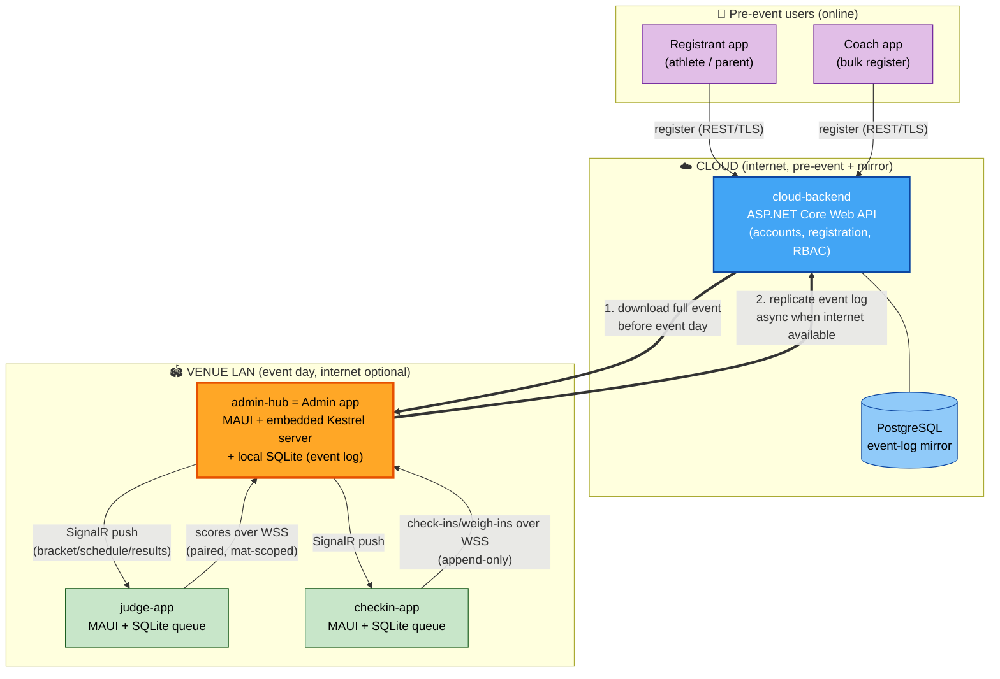
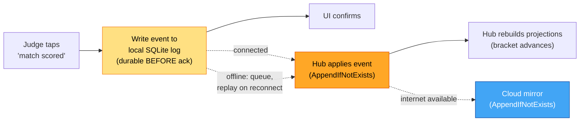
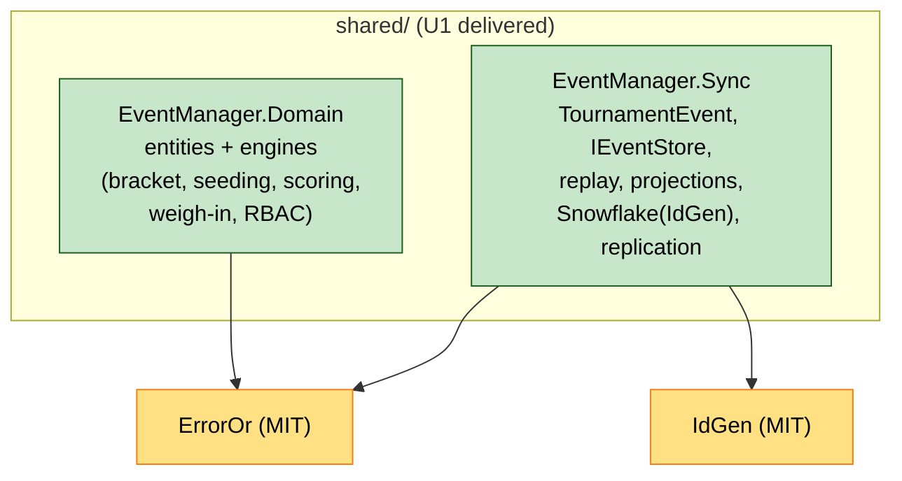

# EventManager — Architecture Overview (orientation draft)

**Status**: Part of the Application Design artifact set (topology + event-flow views). Complements `component-dependency.md` (package graph).
**Source**: tech-env.md "Architecture and Patterns"; requirements.md FR-4 / NFR-6.2.

This is the **hub-and-spoke, offline-first, event-sourced** architecture in two views: (1) topology — who talks to whom; (2) event flow — how data moves without loss.

---

## View 1 — Topology (two worlds: Cloud pre-event, Venue LAN on event day)



**Key point**: the **Admin app IS the hub** — it embeds a web server so Judge/Check-In connect to *it* on the venue LAN, with or without internet. The cloud is only touched twice: download the event beforehand (arrow 1), and mirror the log afterward/whenever online (arrow 2).

### Text alternative
```
CLOUD (online):  Registrant + Coach  --REST/TLS-->  cloud-backend --- PostgreSQL (mirror)

                         | (1) download event before event day
                         v
VENUE LAN (event day, internet optional):
    admin-hub (Admin app = MAUI + embedded Kestrel + SQLite event log)
        <--- scores (WSS, mat-scoped) ---  judge-app  (MAUI + SQLite queue)
        <--- check-ins (WSS, append)  ---  checkin-app (MAUI + SQLite queue)
        ---- SignalR push (brackets/schedule/results) --->  both spokes
                         |
                         | (2) replicate event log async when internet available
                         v
                   cloud-backend  (mirror, never a conflicting source of truth)
```

---

## View 2 — Event flow (why nothing is lost)

Every action becomes an immutable, numbered event. State is a *replay* of the log. Replay is idempotent, so the same event applied twice changes nothing — that is what makes offline queue → reconnect → replay safe.



**The backbone**: `event → local durable write → (queue if offline) → hub applies idempotently → projections update → cloud mirrors idempotently`. The `AppendIfNotExists` idempotence is shown literally in the tech-env.md code sample (lines 86–101).

### Text alternative
```
1. Judge taps "match scored"
2. Event written to device's local SQLite log  (durable BEFORE the UI confirms) -> zero loss
3. If hub reachable: send now.  If offline: queue locally, replay in order on reconnect.
4. Hub applies event with AppendIfNotExists (duplicate replays are no-ops) -> no duplicates
5. Hub rebuilds projections (bracket advances, standings update)
6. When internet is available, hub mirrors the same log to the cloud, also idempotently
```

---

## How this maps to the 5 modules (the D-07 repo layout)

| Module (folder) | Is | Runtime |
|---|---|---|
| `shared/` (**shared-sync-core**, maybe + domain) | Reusable library: event model, log store, idempotent replay, projections (and possibly bracket/scoring engines — that's **Q1/Q2** in the plan) | Consumed by all apps via local NuGet |
| `backend/` (**cloud-backend**) | ASP.NET Core Web API + PostgreSQL, in Docker | Cloud |
| `admin/` (**admin-hub**) | Admin MAUI app + embedded Kestrel = the LAN hub | Organizer's laptop/iPad |
| `judge/` (**judge-app**) | Judge MAUI spoke app | Judges' phones/tablets |
| `checkin/` (**checkin-app**) | Check-In MAUI spoke app | Front-table device |

The design questions (Q1–Q7) are all asking: **which box does each piece of logic live in, and where does it run** — especially how much goes into the shared `shared/` library vs. each app.

---

## As-built: U1 Shared Core (updated 2026-07-24, end-of-unit)

U1 delivered the `shared/` foundation. Internal structure as-built:



**As-built refinements (vs. the high-level graph in `component-dependency.md`):**
- **`EventManager.Sync` is independent of `EventManager.Domain`.** Event payloads are opaque bytes at the Sync layer, so the event-sourcing plumbing is generic and reusable; concrete domain projections live in consuming units. (The earlier `Sync → Domain` edge is superseded by this cleaner layering.)
- Snowflake ids are generated via **IdGen** behind `IIdGenerator`; expected domain failures use **ErrorOr**.
- Text alt: Domain → ErrorOr; Sync → IdGen, ErrorOr; Domain and Sync are siblings with no edge between them.
