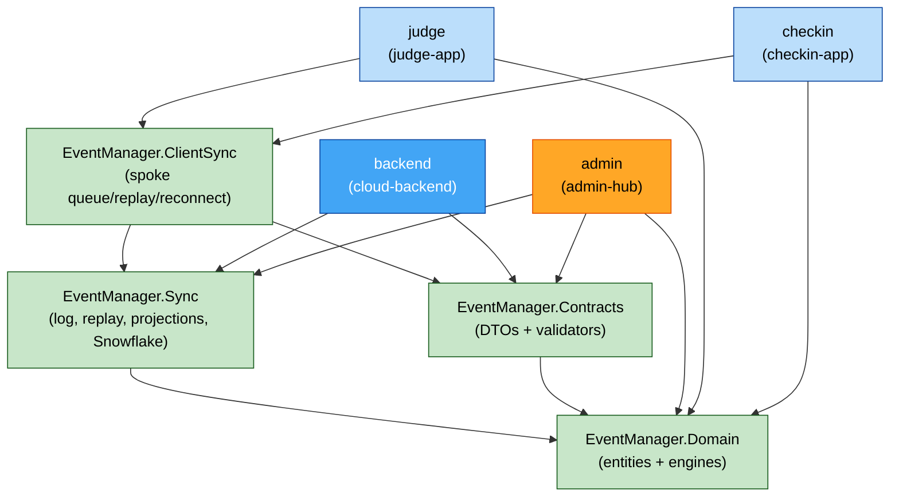

# Application Design — Component Dependencies & Communication

**Stage**: INCEPTION - Application Design
**Date**: 2026-07-24
**See also**: `architecture-overview.md` (topology + event-flow diagrams).

---

## Package dependency graph



### Text alternative
```
Domain      <- Sync, Contracts, Admin, Judge, Checkin      (no dependencies)
Sync        -> Domain                                       (used by Backend, Admin, ClientSync)
Contracts   -> Domain                                       (used by Backend, Admin, ClientSync, spokes)
ClientSync  -> Sync, Contracts                              (used by Judge, Checkin)
Backend     -> Sync, Contracts
Admin       -> Sync, Contracts, Domain
Judge       -> ClientSync (-> Sync, Contracts), Domain
Checkin     -> ClientSync (-> Sync, Contracts), Domain
```
No cycles. `Domain` is the sink (depends on nothing); apps are sources.

---

## Dependency matrix (module → shared package)

| Module | Domain | Sync | Contracts | ClientSync |
|---|:--:|:--:|:--:|:--:|
| backend | ● (via Sync/Contracts) | ● | ● | — |
| admin (hub) | ● | ● | ● | — |
| judge | ● | ● (via ClientSync) | ● (via ClientSync) | ● |
| checkin | ● | ● (via ClientSync) | ● (via ClientSync) | ● |

Admin does **not** use `ClientSync` (it is the hub, not a spoke); it has its own `HubEventStore` + `ReplicationClient`.

---

## Communication patterns

| From → To | Channel | Pattern | Notes |
|---|---|---|---|
| Registrant/Coach → backend | HTTPS/REST + TLS | request/response | Pre-event only (NFR-2.2) |
| backend ↔ hub (download) | HTTPS/REST + TLS | pull (hub initiates) | Full event + role assignments + worker-ID reservations (S-3) |
| hub → backend (replication) | HTTPS/REST + TLS | async batch push, sequence-ordered | `IngestBatch`, idempotent, retry/backoff (S-7) |
| spoke → hub (writes) | WSS (cert-pinned) | idempotent event replay from local queue | mat-scoped / append-only authority (FR-4.5) |
| hub → spoke (updates) | SignalR over WSS | server push | brackets/schedule/results < 2s (NFR-5.2) |
| spoke ↔ hub (discovery) | mDNS → manual-IP/QR | discovery + pairing | fallback-first (FR-4.3) |

---

## Data-flow summary (write path)

```
[origin app] validate (Contracts)
    -> mint Snowflake EventId (Sync, origin worker id)
    -> durable local append (IEventStore / LocalEventQueue)   <-- ack ONLY after this
    -> idempotent apply to peer (AppendIfNotExists)
    -> projection fold (in-memory, Q3)
    -> replicate hub->cloud (sequence-ordered, idempotent)
```

Text: nothing is acknowledged before it is durably persisted; every downstream hop dedupes on `EventId`; ordering/gap-tracking uses the per-device `SequenceNumber` (Q9). This is the chain the flagship zero-data-loss NFR and the PBT suite protect.
