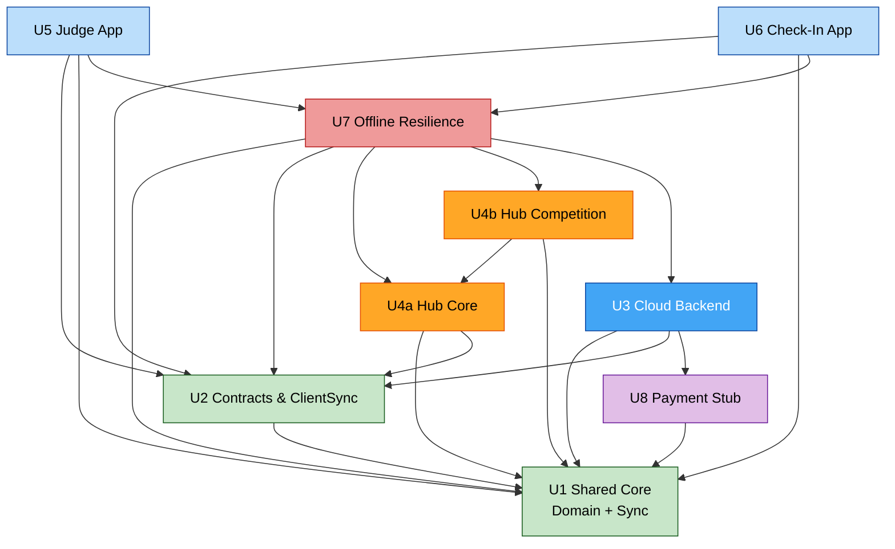

# Units of Work — Dependencies & Build Order

**Stage**: INCEPTION - Units Generation (Part 2)
**Date**: 2026-07-24
**Build order (Q7=A)**: **U1 → U2 → U8 → U3 → U4a → U4b → U7 → U5 → U6**

---

## Dependency graph



### Text alternative
```
U1  depends on: (none)                       [foundation]
U2  depends on: U1
U8  depends on: U1
U3  depends on: U1, U2, U8
U4a depends on: U1, U2
U4b depends on: U4a, U1
U5  depends on: U2, U1, U7
U6  depends on: U2, U1, U7
U7  depends on: U1, U2, U4a, U4b, U3
```
No cycles. U1 is the root; U5/U6 are the leaves. U7 integrates the hub (U4a/U4b) and cloud (U3) resilience paths, then the spokes (U5/U6) consume its queue/reconnect behavior — which is why U7 sequences after the hub and before the spokes.

---

## Dependency matrix

| Unit ↓ depends on → | U1 | U2 | U3 | U4a | U4b | U7 | U8 |
|---|:--:|:--:|:--:|:--:|:--:|:--:|:--:|
| U1 Shared Core | — | | | | | | |
| U2 Contracts & ClientSync | ● | — | | | | | |
| U8 Payment Stub | ● | | — | | | | |
| U3 Cloud Backend | ● | ● | — | | | | ● |
| U4a Hub Core | ● | ● | | — | | | |
| U4b Hub Competition | ● | | | ● | — | | |
| U7 Offline Resilience | ● | ● | ● | ● | ● | — | |
| U5 Judge App | ● | ● | | | | ● | |
| U6 Check-In App | ● | ● | | | | ● | |

---

## Build-order rationale
1. **U1 Shared Core** — everything depends on it; heaviest PBT; nothing precedes it.
2. **U2 Contracts & ClientSync** — needs U1 types; unblocks all apps.
3. **U8 Payment Stub** — small; needed by U3 registration; built just ahead of it.
4. **U3 Cloud Backend** — pre-event surface; consumes U1/U2/U8; enables end-to-end registration testing.
5. **U4a Hub Core** — hub server + pairing + download + offline RBAC; foundation for hub domain work.
6. **U4b Hub Competition** — brackets/scoring/results on top of U4a + U1 engines.
7. **U7 Offline Resilience** — integrates replication (hub↔cloud), backup/recovery, and spoke queue/reconnect once the hub and cloud exist.
8. **U5 Judge / U6 Check-In** — spoke UIs; consume U2 + U7; parallelizable (U5 then U6, or concurrently).

**Parallelization note**: U8 can proceed alongside U2; U5 and U6 can be built concurrently once U7 is in place.
