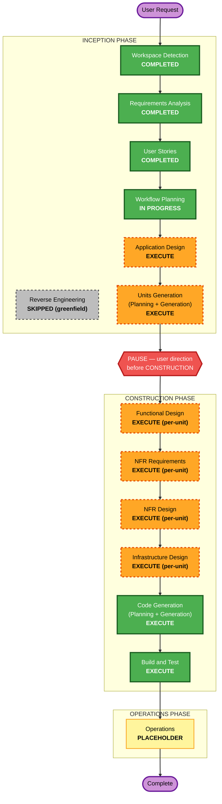

# Execution Plan — EventManager

**Project Type**: Greenfield
**Date**: 2026-07-24
**Source context**: requirements.md (Comprehensive), stories.md (56 stories / 6 epics), personas.md (5 personas)
**Active user constraint**: No code generation / no software build yet — execute INCEPTION through Units Generation, then **stop for user direction** before entering CONSTRUCTION (recorded 2026-07-22, still in force).

---

## Detailed Analysis Summary

### Change Impact Assessment
- **User-facing changes**: Yes — 3 net-new client apps (Admin/hub, Judge, Check-In) plus a cloud registration/account experience; 5 personas with distinct flows.
- **Structural changes**: Yes — net-new distributed, offline-first, event-sourced architecture: LAN hub (embedded Kestrel) + spoke apps + cloud mirror + shared sync/event-log library.
- **Data model changes**: Yes — event-log (append-only) as the system of record; projections for roster, divisions, brackets, schedule, results; cloud PostgreSQL + local SQLite (SQLCipher).
- **API changes**: Yes — all net-new: cloud Web API (accounts, events, registration, replication ingest), hub LAN API (pairing, scoring, check-in/weigh-in, SignalR push).
- **NFR impact**: Yes, and central — offline-first zero-data-loss (flagship NFR-1), Security Baseline, Property-Based Testing, and Resiliency Baseline all enabled at full/blocking enforcement.

### Risk Assessment
- **Risk Level**: **High** — distributed offline-first event sourcing with idempotent multi-hop replay (spoke→hub→cloud), LAN security (TLS pinning + SQLCipher) across Windows/Mac/iOS/Android via MAUI, and correctness-critical bracket/seeding logic.
- **Rollback Complexity**: N/A for greenfield build-out; per-deploy rollback strategy already defined (NFR-3.5, version-pinned image redeploy).
- **Testing Complexity**: **Complex** — PBT mandated on the sync/event-log core (replay idempotence, bracket invariants, seeding, projection oracle), plus example-based business scenarios.

### Architectural Driver
The **sync/event-log core** (event sourcing + idempotent replay + projections) is the deepest dependency in the system. It must be designed and built first; every event-day capability (pairing, check-in, weigh-in, scoring, advancement, replication, recovery) sits on top of it. This drives Units Generation ordering.

---

## Workflow Visualization

### Mermaid Diagram



### Text Alternative (always included)

```
INCEPTION PHASE
  - Workspace Detection ....... COMPLETED
  - Reverse Engineering ....... SKIPPED (greenfield)
  - Requirements Analysis ..... COMPLETED
  - User Stories .............. COMPLETED
  - Workflow Planning ......... IN PROGRESS (this stage)
  - Application Design ........ EXECUTE
  - Units Generation .......... EXECUTE
        |
        v
  >>> PAUSE: stop for user direction before CONSTRUCTION (active constraint) <<<
        |
        v
CONSTRUCTION PHASE (per-unit loop, then build/test)
  - Functional Design ......... EXECUTE (per-unit)
  - NFR Requirements .......... EXECUTE (per-unit)
  - NFR Design ................ EXECUTE (per-unit)
  - Infrastructure Design ..... EXECUTE (per-unit)
  - Code Generation ........... EXECUTE
  - Build and Test ............ EXECUTE

OPERATIONS PHASE
  - Operations ................ PLACEHOLDER (future)
```

---

## Phases to Execute

### INCEPTION PHASE
- [x] Workspace Detection (COMPLETED)
- [x] Reverse Engineering (SKIPPED — greenfield, no existing code)
- [x] Requirements Analysis (COMPLETED — approved 2026-07-22)
- [x] User Stories (COMPLETED — approved 2026-07-24; 56 stories, 6 epics)
- [x] Workflow Planning (IN PROGRESS)
- [ ] Application Design — **EXECUTE**
  - **Rationale**: Entirely net-new system with multiple components/services (cloud API, hub server, 3 client apps, shared sync library). Component boundaries, methods, business rules (event-sourcing engine, bracket/seeding engine, RBAC authority model), and inter-component dependencies must be defined before decomposition.
- [ ] Units Generation — **EXECUTE**
  - **Rationale**: System requires decomposition into multiple buildable units across 5 modules. The sync/event-log core is the critical-path first unit; explicit unit boundaries, dependency ordering, and story-to-unit mapping are needed to sequence Construction.

> **After Units Generation: PAUSE.** Per the active user constraint, stop and await explicit direction before beginning the CONSTRUCTION phase.

### CONSTRUCTION PHASE (planned; not started until user lifts the pause)
- [ ] Functional Design — **EXECUTE (per-unit)**
  - **Rationale**: New data models/schemas (event log, projections) and correctness-critical business logic (idempotent replay, bracket invariants, seeding, weigh-in policy resolution, RBAC) need detailed per-unit design. Also where PBT properties are identified per unit.
- [ ] NFR Requirements — **EXECUTE (per-unit)**
  - **Rationale**: Security Baseline, Property-Based Testing, and Resiliency Baseline are enabled at full enforcement; performance targets (NFR-5) and tech-stack specifics apply per unit.
- [ ] NFR Design — **EXECUTE (per-unit)**
  - **Rationale**: NFR Requirements will execute; security/resiliency/testing patterns must be incorporated into each unit's design (TLS pinning, SQLCipher, retry/backoff, health checks, PBT harness).
- [ ] Infrastructure Design — **EXECUTE (per-unit)**
  - **Rationale**: Deployment architecture required — Docker image + Docker Compose (API + PostgreSQL), provider-agnostic (D-10); LAN hub topology, mDNS/QR discovery, SignalR transport.
- [ ] Code Generation — **EXECUTE (ALWAYS)**
  - **Rationale**: Implementation planning and code generation for each unit.
- [ ] Build and Test — **EXECUTE (ALWAYS)**
  - **Rationale**: Build all units, run unit/PBT/integration tests, coverage gate on sync core.

### OPERATIONS PHASE
- [ ] Operations — **PLACEHOLDER** (future deployment/monitoring workflows)

---

## Suggested Unit Decomposition (preview — finalized in Units Generation)

This is directional input to Units Generation, not a committed breakdown:

1. **shared-sync-core** (critical path) — event-log store, event model/serialization, idempotent replay, projection framework. Underpins everything; built first. Heaviest PBT focus.
2. **cloud-backend** — accounts/RBAC (FR-1, FR-2.7/2.8), event & registration management, division config, replication ingest (`AppendIfNotExists`), results read models.
3. **admin-hub** — Kestrel LAN server, event download, pairing/device management, bracket & seeding engine, weigh-in policy resolution, live standings, backup/recovery, hub→cloud replication.
4. **judge-app** — mat queue, point-sparring & forms scoring, cross-mat read-only view, focus mode, offline queue/replay.
5. **checkin-app** — check-in, weigh-in + range validation, recommendations, offline queue/replay.

Mapped to the repo layout (D-07): `shared/`, `backend/`, `admin/`, `judge/`, `checkin/`.

---

## Estimated Timeline
- **Remaining INCEPTION stages**: 2 (Application Design, Units Generation) before the pause.
- **CONSTRUCTION**: per-unit loop across ~5 units (4 design stages + code gen each) + final Build and Test — scoped after the pause.

## Success Criteria
- **Primary Goal**: A working offline-first tournament management MVP (Admin/hub + Judge + Check-In + cloud) with zero event-day data loss.
- **Key Deliverables**: 5 modules per D-07 layout; shared sync/event-log core; Docker/Compose backend; PBT suite on the sync core; recovery runbooks.
- **Quality Gates**: Build + unit tests + PBT green; 80%+ coverage on sync/event-log core (NFR-4.1); Security/Resiliency baseline compliance at each stage gate.
