# Execution Plan — Unit U10: HTTP Replication Adapter

**Stage**: INCEPTION → Workflow Planning
**Date**: 2026-07-27
**Inputs**: `inception/requirements/u10-http-replication-requirements.md` (approved), `inception/user-stories/stories.md` Epic 8 US-801..810 (approved), `inception/plans/u10-story-generation-plan.md`
**Branch**: `unit/u10-http-replication`

---

## 1. Detailed Analysis Summary

### Transformation Scope

- **Transformation Type**: Multi-component application change **plus** an infrastructure change.
- **Primary Changes**: implement the deferred `ICloudReplicationTransport` seam over HTTP, and give the hub a cloud identity of its own so it can use it.
- **Related Components**: `backend/EventManager.Api` (new credential entity, issuing endpoint, authentication handler, high-water-mark endpoint, ingest hardening, EF migration); `admin/EventManager.Hub` (secret protection, credential store, HTTP transport, replication triggers, health status, metrics); the cloud Compose stack (OTLP collector); `backend/tests` and `admin/tests`; Postman (both representations).
- **Explicitly untouched**: `shared/` — no wire-contract change (D-U10-15).

### Change Impact Assessment

| Area | Impact |
|---|---|
| **User-facing changes** | **Yes.** An organizer gains a credential lifecycle they must operate: issue, install, monitor, revoke (US-801, US-802, US-806, US-808). |
| **Structural changes** | **Yes.** A second principal type in the cloud's authentication model — today it only knows how to authenticate a person. |
| **Data model changes** | **Yes.** New credential entity and an EF migration. Additive; no existing table altered. |
| **API changes** | **Additive** — one issuing endpoint, one high-water-mark endpoint. `POST /api/ingest/batch` gains a new accepted principal type and new limits, but its request/response contract is unchanged. |
| **NFR impact** | **Yes.** New authentication surface (security), circuit breaking and timeouts (resiliency), a lag objective and completeness gate (U10-NFR-1/2), and new observability. |
| **Infrastructure impact** | **Yes.** A collector service is added to the Compose stack (F3=B). This is what makes Infrastructure Design non-skippable. |
| **Operations impact** | Metrics begin flowing; dashboards, alert rules, and retention remain **out of scope** (requirements §7) and stay open at project level. |

### Component Relationships

- **Primary components**: `backend/EventManager.Api`, `admin/EventManager.Hub`
- **Shared components**: `shared/EventManager.Contracts` (consumed, **not modified**), `shared/EventManager.Sync` (consumed)
- **Dependent components**: none — nothing depends on the hub's transport choice; the in-process `StoreBackedReplicationTransport` remains for tests
- **Supporting components**: Compose stack, Caddy, Postman collections, `backend/tests/EventManager.Api.Tests`, `admin/tests`

| Component | Change type | Reason | Priority |
|---|---|---|---|
| `backend/EventManager.Api` | Major | New principal type, new endpoints, migration, hardening | Critical |
| `admin/EventManager.Hub` | Major | New transport, secret protection, triggers, observability | Critical |
| `admin/.../ReplicationClient.cs` | Minor (behavioural) | Retry only transient failures (D-U10-03) — **merged U7 code** | Critical |
| Compose stack | Minor | Collector service (F3=B) | Important |
| Postman (×2 representations) | Minor | New endpoints and negative cases | Important |
| `shared/` | **None** | Deliberately unchanged | — |

### Risk Assessment

- **Risk Level**: **High**

  Argued for Medium: the change is additive, the hub remains authoritative during an event, and the transport can be swapped back to the in-process implementation in one line.

  **High is chosen** for three reasons that a rollback does not undo. (1) It is a new authentication path — a scope error either blocks replication at a live tournament or admits a writer to the wrong event, and the requirements stage already caught one security error in this unit's answers. (2) It modifies `ReplicationClient`, which the flagship zero-data-loss guarantee (NFR-1.1/1.2) rests on; a regression there is silent until an outage exposes it. (3) It is the first change to touch three surfaces plus infrastructure in one unit.

  Not Critical: nothing is in production, the hub keeps operating with zero cloud access, and no existing data is migrated or rewritten.

- **Rollback Complexity**: **Moderate.** The hub side is additive and reversible by re-registering the in-process transport. The backend side carries an **EF migration**, so rollback is a migration-down rather than a revert — the reason this is not "Easy" as U9 was.
- **Testing Complexity**: **Complex.** A cross-solution reference (U10-CON-4), a property over interleaved outages/retries/restarts, and a manual walkthrough as the primary integration verification (Q11=D).

---

## 2. Workflow Visualization

```mermaid
flowchart TD
    Start(["U10 Request"])

    subgraph INCEPTION["INCEPTION PHASE"]
        RA["Requirements Analysis<br/><b>COMPLETED</b>"]
        US["User Stories<br/><b>COMPLETED</b>"]
        WP["Workflow Planning<br/><b>IN PROGRESS</b>"]
        AD["Application Design<br/><b>EXECUTE</b>"]
        UG["Units Generation<br/><b>SKIP</b>"]
    end

    subgraph CONSTRUCTION["CONSTRUCTION PHASE"]
        FD["Functional Design<br/><b>EXECUTE</b>"]
        NFRA["NFR Requirements<br/><b>EXECUTE minimal</b>"]
        NFRD["NFR Design<br/><b>EXECUTE</b>"]
        ID["Infrastructure Design<br/><b>EXECUTE</b>"]
        CG["Code Generation<br/><b>EXECUTE</b>"]
        BT["Build and Test<br/><b>EXECUTE</b>"]
    end

    Start --> RA
    RA --> US
    US --> WP
    WP --> AD
    AD --> UG
    UG --> FD
    FD --> NFRA
    NFRA --> NFRD
    NFRD --> ID
    ID --> CG
    CG --> BT
    BT --> Done(["Merge to main"])

    style RA fill:#4CAF50,stroke:#1B5E20,stroke-width:3px,color:#fff
    style US fill:#4CAF50,stroke:#1B5E20,stroke-width:3px,color:#fff
    style WP fill:#4CAF50,stroke:#1B5E20,stroke-width:3px,color:#fff
    style AD fill:#FFA726,stroke:#E65100,stroke-width:3px,stroke-dasharray: 5 5,color:#000
    style UG fill:#BDBDBD,stroke:#424242,stroke-width:2px,stroke-dasharray: 5 5,color:#000
    style FD fill:#FFA726,stroke:#E65100,stroke-width:3px,stroke-dasharray: 5 5,color:#000
    style NFRA fill:#FFA726,stroke:#E65100,stroke-width:3px,stroke-dasharray: 5 5,color:#000
    style NFRD fill:#FFA726,stroke:#E65100,stroke-width:3px,stroke-dasharray: 5 5,color:#000
    style ID fill:#FFA726,stroke:#E65100,stroke-width:3px,stroke-dasharray: 5 5,color:#000
    style CG fill:#4CAF50,stroke:#1B5E20,stroke-width:3px,color:#fff
    style BT fill:#4CAF50,stroke:#1B5E20,stroke-width:3px,color:#fff
    style Start fill:#CE93D8,stroke:#6A1B9A,stroke-width:3px,color:#000
    style Done fill:#CE93D8,stroke:#6A1B9A,stroke-width:3px,color:#000

    linkStyle default stroke:#333,stroke-width:2px
```

**Text alternative** (per `common/content-validation.md`): the flow runs linearly from the U10 request through Requirements Analysis (completed) → User Stories (completed) → Workflow Planning (in progress) → Application Design (execute) → Units Generation (skipped) → Functional Design (execute) → NFR Requirements (execute, minimal depth) → NFR Design (execute) → Infrastructure Design (execute) → Code Generation (execute) → Build and Test (execute) → merge to main. Green nodes are completed or always-execute stages; orange dashed nodes are conditional stages selected for execution; the single grey dashed node is the skipped stage.

---

## 3. Phases to Execute

### INCEPTION PHASE

- [x] Workspace Detection — COMPLETED (resume; project state found)
- [x] Reverse Engineering — SKIPPED (greenfield project, design artifacts current)
- [x] Requirements Analysis — COMPLETED (approved 2026-07-27)
- [x] User Stories — COMPLETED (approved 2026-07-27; Epic 8, US-801..810)
- [x] Workflow Planning — IN PROGRESS
- [ ] **Application Design — EXECUTE**
  - **Rationale**: This is where U10 differs most from U9, which skipped it. U10 introduces genuinely new components across two solutions — a credential entity and authentication handler in the cloud, and a secret protector, credential store, HTTP transport, and replication scheduler in the hub — and their boundaries and dependencies are not derivable from existing code. Most importantly, **U10-CON-5 is a component-interaction decision** (how a credential travels from the cloud to a hub with no UI) and this is the stage that owns it. Depth: standard.
- [ ] **Units Generation — SKIP**
  - **Rationale**: One coherent unit of work on one branch. It spans three surfaces, but decomposing it would create units that cannot be independently delivered — the hub half is useless without the cloud half. Sequencing is handled by §4 below rather than by unit decomposition.

### CONSTRUCTION PHASE

- [ ] **Functional Design — EXECUTE**
  - **Rationale**: Credential lifecycle states (issued → active → expired/revoked), the failure-classification rules behind US-804's table, circuit-breaker state transitions, and the completeness gate all need business rules (`BR-REPL-*`) before code. Independently, **PBT-01 is a blocking rule while the Property-Based Testing extension is enabled**, which makes this stage non-skippable regardless — the same constraint noted in U9's plan. Depth: standard.
- [ ] **NFR Requirements — EXECUTE (minimal depth)**
  - **Rationale**: Scoped to **tech-stack selection only** — U10-NFR-1..8 are already written and approved, so this stage will not re-derive them. What is genuinely undecided is which libraries: the OpenTelemetry exporter and collector image, the rate-limiting implementation (ASP.NET Core's built-in limiter versus a library), and the secret-protection API. Those are new production dependencies, which SECURITY-10 attaches to, and they should not be chosen silently during code generation.
- [ ] **NFR Design — EXECUTE**
  - **Rationale**: Follows from NFR Requirements executing. Owns the concrete patterns: circuit-breaker thresholds and half-open behaviour, retry/backoff interaction with `Retry-After`, secret-protection seam shape (U10-CON-1), rate-limit policy and its numeric limit (U10-CON-3), and metric naming. Depth: standard.
- [ ] **Infrastructure Design — EXECUTE (mandatory, not a judgment call)**
  - **Rationale**: F3=B adds a collector service to the Compose stack. SECURITY-07 requires its network exposure to be evaluated, SECURITY-02 its access logging, and RESILIENCY-05 its place in the observability picture. This stage cannot be skipped for this unit.
- [ ] **Code Generation — EXECUTE (always)**
  - **Rationale**: Plan then generate, per the two-part stage.
- [ ] **Build and Test — EXECUTE (always, per-unit)**
  - **Rationale**: Five solutions must stay green; the 153-test baseline must not regress; CS-1 (no ternaries) verified.

### OPERATIONS PHASE

- [ ] Operations — PLACEHOLDER (dashboards, alert rules, and retention for the new metrics land here; explicitly out of this unit's scope)

---

## 4. Package Change Sequence

| # | Package | Change | Why this position |
|---|---|---|---|
| 1 | `shared/` | **None** | Recorded explicitly so the sequence is unambiguous — D-U10-15 forbids a wire-contract change |
| 2 | `backend/EventManager.Api` | Credential entity + issuing endpoint + authentication handler + high-water-mark endpoint + ingest hardening + EF migration | The credential's shape defines the wire; the hub cannot be built against an endpoint that does not exist |
| 3 | `backend/tests/EventManager.Api.Tests` | Unit tests for every backend addition | Same pattern as U3/U9; the backend half must be green before the hub consumes it |
| 4 | `admin/EventManager.Hub` | `ISecretProtector` + credential store, `HttpCloudReplicationTransport`, replication triggers, health status, OTLP metrics | Consumes step 2 |
| 5 | `admin/.../ReplicationClient.cs` | Retry only transient failures (D-U10-03) | Deliberately separated from step 4 — it is the only edit to **merged U7 code**, and the 17 existing admin tests must stay green across it |
| 6 | `admin/tests` | Stub-handler unit tests + the PBT property | Consumes steps 4–5 |
| 7 | Cross-solution test | One credential-path end-to-end test (F4=B, U10-CON-4) | Requires both halves complete |
| 8 | Compose stack | OTLP collector service + configuration | Independent of the code path; can proceed in parallel with 4–7 |
| 9 | Postman — **both** representations | New endpoints and negative cases | The JSON and the extension directory format must both be updated and must not drift |
| 10 | Docs | As-built architecture diagrams + developer verification / user testing guide | End-of-unit deliverables, required before the merge gate |

**Coordination points**: `ReplicationBatchDto`/`ReplicationAckDto` (frozen), the credential wire format (fixed at step 2), and the ingest route's limits (step 2) which step 5's classifier must honour.

**Testing checkpoints**: after step 3 (backend green), after step 6 (hub green, no U7 regression), after step 7 (seam verified), and at Build and Test (all five solutions, 153-test baseline plus new tests).

---

## 5. Success Criteria

- **Primary goal**: the hub replicates to the cloud over a real network, authenticated as itself, and an outage remains a non-event.
- **Key deliverables**: `HttpCloudReplicationTransport`; hub credential issue/authenticate/revoke; high-water-mark seeding; classified retry and circuit breaking; three replication triggers plus the completeness gate; ingest hardening; collector service; tests at all three levels; both Postman representations; end-of-unit docs.
- **Quality gates**:
  - All five solutions build with **0 warnings**; the **153-test baseline does not regress**.
  - The 17 existing admin tests stay green across the `ReplicationClient` change.
  - CS-1 verified — no ternary operators in new code.
  - Every enabled extension rule evaluated and non-N/A findings resolved before the end-of-unit gate.
  - **Integration Scenarios 2 and 4** in `construction/build-and-test/integration-test-instructions.md` move from ⛔ blocked to executable — this is the unit's stated purpose and the most direct measure of whether it succeeded.
- **Explicit non-goals**: dashboards and alerting on the new metrics; SQLCipher; non-Windows secret protection; mTLS.

---

## 6. Process Requirements (project rules, not AI-DLC rules)

1. All work happens on `unit/u10-http-replication`, branched from `main`, merged only after end-of-unit approval.
2. Before that gate: **as-built architecture diagrams updated** and a **user testing guide authored** (developer verification guide plus, for this unit, the manual docker-compose walkthrough that Q11=D makes the primary integration verification).
3. Nothing is pushed to any remote unless explicitly requested.

---

## 7. Sizing, Honestly

Seven stages execute and one is skipped — heavier than U9 (three executed, five skipped) and comparable to U3, the only other unit run fully stage-by-stage.

That weight is a consequence of the requirement answers, not of the original request. If it is more ceremony than wanted, the natural collapse is the one already used for U4a, U4b, U5, U6 and U7: **fast-track Application Design, NFR Requirements, and NFR Design into Functional Design**, keeping Functional Design (PBT-01 blocking), Infrastructure Design (Compose change), Code Generation, and Build and Test as separate gates. That would take it from seven stages to four.

The recommendation is still to run it stage-by-stage. The reason is specific rather than procedural: this unit adds an authentication path and edits the code the flagship offline guarantee depends on, and those are exactly the two things that a compressed pass tends to get subtly wrong. But it is a judgment call, and the fast-track is a legitimate choice.
