# Execution Plan — Unit U9: Read/Query API

**Created**: 2026-07-26
**Stage**: INCEPTION → Workflow Planning
**Inputs**: [u9-read-api-requirements.md](../requirements/u9-read-api-requirements.md) (approved) ·
[stories.md](../user-stories/stories.md) Epic 7 US-701..US-710 (approved) ·
[personas.md](../user-stories/personas.md) (approved)

---

## 1. Detailed Analysis Summary

### Transformation Scope
- **Transformation Type**: Single component — additive change to an existing service
- **Primary Changes**: 9 new GET endpoints on `backend/EventManager.Api`, governed by a new
  three-tier read authorization model
- **Related Components**: `backend/tests/EventManager.Api.Tests`. Conditionally
  `shared/EventManager.Domain` — **only** if U9-CON-1 is resolved toward extending the shared
  `OrganizerAction` enum, which would also reach `admin/EventManager.Hub`

### Change Impact Assessment

| Area | Impact | Detail |
|---|---|---|
| **User-facing** | **Yes** | New read capability for P1 Organizer, P2 Coach, P3 Registrant. Makes events discoverable to prospective registrants for the first time |
| **Structural** | **Minor** | No new top-level component. Adds query services and one read-authorization component inside the existing API |
| **Data model** | **No** | No new entities, events, projections, or migrations. Reads existing read-model tables only |
| **API** | **Yes — additive only** | 9 new endpoints. No existing endpoint's contract changes; nothing is removed or renamed |
| **NFR** | **Yes** | New authorization surface (security-sensitive) and a new caching mechanism (watermark ETags) |

### Component Relationships

- **Primary Component**: `backend/EventManager.Api` — Major change (new controllers, query services, read authorizer)
- **Supporting Component**: `backend/tests/EventManager.Api.Tests` — Major change (tier matrix + PBT)
- **Shared Component**: `shared/EventManager.Domain` — **Conditional**, Minor. Only under the
  U9-CON-1 "extend the shared enum" branch. Change priority: avoid if possible
- **Dependent Component**: `admin/EventManager.Hub` — **Conditional**, Configuration-only. Affected
  only via the shared branch above, because `OfflineOrganizerAuth` consumes the same policy
- **Unaffected**: `EventManager.Payments`, `EventManager.Judge*`, `EventManager.Checkin*`,
  `EventManager.Sync`, `EventManager.Contracts`, `EventManager.ClientSync`

### Risk Assessment

- **Risk Level**: **Medium**
- **Rollback Complexity**: **Easy** — purely additive endpoints, no database migration, no change to
  any write path. Rolling back is redeploying the previous image
- **Testing Complexity**: **Moderate** — a 3-tier × 5-resource behaviour matrix plus negative cases,
  under a blocking property-based-testing extension

**Why Medium and not Low**: the change is read-only and trivially reversible, which argues for Low.
It is Medium because the unit's substance is an authorization model, and an error in tier resolution
discloses personal data (dates of birth, weights, contact emails) to the wrong caller — a failure
that a rollback does not undo. The requirements stage already caught one such error before it was
built (unrestricted account lookup, Q5=C). U9-CON-2 is a second known trap, now pinned by US-710.

**Why not High**: no schema change, no write-path change, no cross-system coordination, no
infrastructure change, and every failure mode is contained to one service.

---

## 2. Workflow Visualization

```mermaid
flowchart TD
    Start(["U9 Request: read/query API"])

    subgraph INCEPTION["INCEPTION PHASE"]
        WD["Workspace Detection<br/><b>COMPLETED</b>"]
        RA["Requirements Analysis<br/><b>COMPLETED</b>"]
        US["User Stories<br/><b>COMPLETED</b>"]
        WP["Workflow Planning<br/><b>IN PROGRESS</b>"]
        AD["Application Design<br/><b>SKIP</b>"]
        UG["Units Generation<br/><b>SKIP</b>"]
    end

    subgraph CONSTRUCTION["CONSTRUCTION PHASE"]
        FD["Functional Design<br/><b>EXECUTE</b>"]
        NFRA["NFR Requirements<br/><b>SKIP</b>"]
        NFRD["NFR Design<br/><b>SKIP</b>"]
        ID["Infrastructure Design<br/><b>SKIP</b>"]
        CG["Code Generation<br/><b>EXECUTE</b>"]
        BT["Build and Test<br/><b>EXECUTE</b>"]
    end

    subgraph OPERATIONS["OPERATIONS PHASE"]
        OPS["Operations<br/><b>PLACEHOLDER</b>"]
    end

    Start --> WD
    WD --> RA
    RA --> US
    US --> WP
    WP --> AD
    AD --> UG
    UG --> FD
    FD --> NFRA
    NFRA --> NFRD
    NFRD --> ID
    ID --> CG
    CG --> BT
    BT --> OPS
    BT --> Done(["U9 Complete"])

    style WD fill:#4CAF50,stroke:#1B5E20,stroke-width:3px,color:#fff
    style RA fill:#4CAF50,stroke:#1B5E20,stroke-width:3px,color:#fff
    style US fill:#4CAF50,stroke:#1B5E20,stroke-width:3px,color:#fff
    style WP fill:#4CAF50,stroke:#1B5E20,stroke-width:3px,color:#fff
    style CG fill:#4CAF50,stroke:#1B5E20,stroke-width:3px,color:#fff
    style BT fill:#4CAF50,stroke:#1B5E20,stroke-width:3px,color:#fff
    style FD fill:#FFA726,stroke:#E65100,stroke-width:3px,stroke-dasharray: 5 5,color:#000
    style AD fill:#BDBDBD,stroke:#424242,stroke-width:2px,stroke-dasharray: 5 5,color:#000
    style UG fill:#BDBDBD,stroke:#424242,stroke-width:2px,stroke-dasharray: 5 5,color:#000
    style NFRA fill:#BDBDBD,stroke:#424242,stroke-width:2px,stroke-dasharray: 5 5,color:#000
    style NFRD fill:#BDBDBD,stroke:#424242,stroke-width:2px,stroke-dasharray: 5 5,color:#000
    style ID fill:#BDBDBD,stroke:#424242,stroke-width:2px,stroke-dasharray: 5 5,color:#000
    style OPS fill:#BDBDBD,stroke:#424242,stroke-width:2px,stroke-dasharray: 5 5,color:#000
    style INCEPTION fill:#BBDEFB,stroke:#1565C0,stroke-width:3px,color:#000
    style CONSTRUCTION fill:#C8E6C9,stroke:#2E7D32,stroke-width:3px,color:#000
    style OPERATIONS fill:#FFF59D,stroke:#F57F17,stroke-width:3px,color:#000
    style Start fill:#CE93D8,stroke:#6A1B9A,stroke-width:3px,color:#000
    style Done fill:#CE93D8,stroke:#6A1B9A,stroke-width:3px,color:#000

    linkStyle default stroke:#333,stroke-width:2px
```

**Text alternative**: Workspace Detection, Requirements Analysis, User Stories, and Workflow
Planning are complete. Application Design and Units Generation are skipped. In Construction,
Functional Design executes; NFR Requirements, NFR Design, and Infrastructure Design are skipped;
Code Generation and Build and Test execute. Operations remains a placeholder.

---

## 3. Phases to Execute

### 🔵 INCEPTION PHASE
- [x] **Workspace Detection** — COMPLETED (state file found, resumed)
- [x] **Reverse Engineering** — SKIPPED (design artifacts current and as-built)
- [x] **Requirements Analysis** — COMPLETED, approved 2026-07-26
- [x] **User Stories** — COMPLETED, approved 2026-07-26 (Epic 7, US-701..US-710)
- [x] **Workflow Planning** — IN PROGRESS (this document)
- [ ] **Application Design** — **SKIP**
  - **Rationale**: U9 introduces no new top-level component or service boundary. It adds controllers
    and query services inside `EventManager.Api`, which the project-level Application Design already
    identified. The one genuine component-boundary question is U9-CON-1, and it is bounded enough
    for Functional Design to settle.
  - **⚠️ Reconsider if**: you want the U9-CON-1 decision resolved toward **extending the shared
    `OrganizerAction` enum**. That changes a shared component consumed by U4a's `OfflineOrganizerAuth`,
    which is a cross-component architectural decision that warrants Application Design. If you
    prefer that route, add this stage back.
- [ ] **Units Generation** — **SKIP**
  - **Rationale**: U9 is a single unit of work against a single component. There is nothing to
    decompose.

### 🟢 CONSTRUCTION PHASE
- [ ] **Functional Design** — **EXECUTE**
  - **Rationale**: Three things need designing before code. (1) Tier resolution — the cumulative,
    per-event rules from US-701..703 and how they compose. (2) **U9-CON-1** — shared enum versus an
    API-local read authorizer. (3) **U9-CON-2** — how the watermark ETag avoids serving stale
    athlete-profile data, now a pinned acceptance criterion in US-710. Independently, **PBT-01 is
    blocking and mandates property identification in Functional Design artifacts**, so this stage
    cannot be skipped while the Property-Based Testing extension is enabled.
- [ ] **NFR Requirements** — **SKIP**
  - **Rationale**: The tech stack is already fixed by U3 (ASP.NET Core, EF Core/PostgreSQL, xUnit,
    FsCheck) and this unit introduces no new technology choice. The unit's NFRs were already
    enumerated and approved as U9-NFR-1..9 in the requirements document, so re-deriving them here
    would restate approved content. **PBT-09** (framework selection) is satisfied — FsCheck is
    already a project dependency and in use in `EventManager.Api.Tests`.
- [ ] **NFR Design** — **SKIP**
  - **Rationale**: Follows the NFR Requirements skip. The NFR patterns this unit relies on —
    deny-by-default authorization, structured logging, fail-closed error handling — were designed in
    U3's `nfr-design/` and are reused unchanged, not redesigned.
- [ ] **Infrastructure Design** — **SKIP**
  - **Rationale**: Zero infrastructure change. Same container, same database, same Compose
    deployment, same Caddy front end, same backup and health-check wiring. Recorded as U9-NFR-6,
    which inherits U3's targets (Medium criticality, 99.5%, RTO ≤ 4h, RPO ≤ 24h).
- [ ] **Code Generation** — **EXECUTE** (always)
  - **Rationale**: Part 1 planning then Part 2 generation of controllers, query services, the read
    authorizer, and the test suite.
- [ ] **Build and Test** — **EXECUTE** (always)
  - **Rationale**: Build the backend solution and run the full suite. Current baseline is 96 tests
    green across all solutions.

### 🟡 OPERATIONS PHASE
- [ ] **Operations** — PLACEHOLDER

---

## 4. Process Requirements for This Unit

Two project process rules apply and are not part of the AI-DLC rule set:

1. **Per-unit git branch** — all U9 work happens on `unit/u9-read-api`, branched from `main`, and
   merges to `main` only after end-of-unit approval.
2. **End-of-unit deliverables** — before merge, U9 must (a) update the architecture-overview diagrams
   to as-built and (b) author a user testing guide. For a backend unit that means a developer
   verification guide, consistent with U3's.

**Note**: the last post-MVP change (account self-deletion, US-110) bypassed rule 1 and was merged
directly to `main`. This plan follows the rule.

---

## 5. Package Change Sequence

**U9-CON-1 resolved 2026-07-26** — the user chose the **API-local read authorizer**. The conditional
shared-component steps are struck from the sequence; `shared/EventManager.Domain` and
`admin/EventManager.Hub` are **not touched by this unit**.

| Order | Package | Change | Reason |
|---|---|---|---|
| 1 | `backend/EventManager.Api` | Major | The unit itself — API-local read authorizer, query services, controllers |
| 2 | `backend/tests/EventManager.Api.Tests` | Major | Tier matrix, negative cases, PBT |

~~`shared/EventManager.Domain`~~ and ~~`admin/EventManager.Hub`~~ — dropped. They were conditional on
extending the shared `OrganizerAction` enum, which the U9-CON-1 decision rules out.

This also confirms the **Application Design skip is safe**: the sole condition under which it should
have been reconsidered (a shared-component change reaching U4a) no longer applies.

---

## 6. Success Criteria

**Primary Goal**: every persona can read exactly the event data their tier entitles them to, and
nothing more.

**Key Deliverables**
- 9 GET endpoints implemented per the approved inventory
- A read-authorization component implementing tiers T0/T1/T2
- Test coverage for the full tier × resource matrix, including negative cases
- Property-based tests for the invariants identified at Functional Design
- Architecture diagrams updated to as-built; developer verification guide authored

**Quality Gates**
- `dotnet build backend/EventManager.Backend.slnx` succeeds
- All existing tests stay green — 96 across all solutions is the current baseline; no regression
- Every U9-FR traces to a passing test
- **Security Baseline**: no non-compliant rule at any stage (SECURITY-08 is the load-bearing one)
- **PBT**: property identification present in Functional Design artifacts (PBT-01); PBT present
  alongside example-based tests (PBT-10)
- **CS-1**: no ternary `?:` operators in new code
- US-710's U9-CON-2 criterion passes — no 304 carrying stale profile data

---

## 7. Estimated Effort

- **Stages remaining**: 3 (Functional Design → Code Generation → Build and Test)
- **Relative size**: smaller than U3 (which built the entire API from nothing) and comparable to
  U4b. No new persistence, no new infrastructure, no new dependencies.
- **Dominant cost**: the test matrix, not the production code. Nine endpoints over existing read
  models is a modest amount of code; the tier × resource × negative-case matrix under a blocking PBT
  extension is where the work concentrates.
